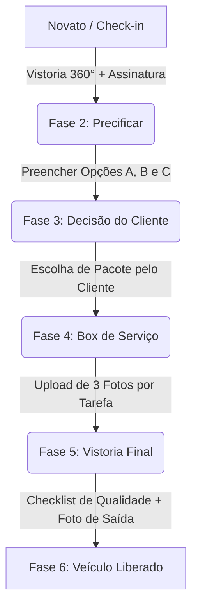

# CerraCar - Plataforma de Gestão & Auditabilidade Extrema

O **CerraCar** é um protótipo funcional de alta fidelidade (MVP) desenvolvido para revolucionar a relação de confiança entre oficinas mecânicas e seus clientes. Através de um conceito inovador de **transparência fotográfica** e um **workflow impositivo de estados**, a plataforma elimina a assimetria de informações e garante a auditabilidade total de todas as etapas de manutenção de um veículo.

---

## 🎯 Objetivo do Sistema

Tradicionalmente, a manutenção automotiva sofre com a falta de transparência: clientes têm dificuldade de validar se as peças foram realmente trocadas, e oficinas carecem de comprovação formal contra alegações de danos pré-existentes na lataria.

O **CerraCar** resolve esse problema ao:
1. **Documentar visualmente a chegada**: Mapeando avarias em um diagrama 360° interativo e coletando a assinatura de conformidade do cliente no pátio.
2. **Impedir pulos de etapas**: Forçando uma sequência operacional lógica e auditada (Check-in ➔ Precificação ➔ Aprovação do Cliente ➔ Execução Fotográfica no Box ➔ Controle de Qualidade ➔ Entrega).
3. **Comprovar a execução**: Exigindo fotos da peça antiga, da peça nova na embalagem e da peça instalada no veículo para cada tarefa da ordem de serviço.
4. **Gerar um Dossiê Vitalício**: Um histórico permanente, compartilhável por WhatsApp e otimizado para impressão física, que serve como certidão de idoneidade do serviço prestado.

---

## 🎨 Identidade Visual: "Dark Industrial & Amber"

A interface foi projetada sob uma estética moderna de alto contraste, inspirada em montadoras e ecossistemas industriais automotivos de alto padrão:

* **Base e Fundo**: Fundo principal quase preto (`#0A0A0A`) com uma sutil aura de iluminação radial em âmbar.
* **Cards e Módulos (Glassmorphic)**: Containers em cinza grafite escuro (`#171717`) com bordas finas semi-transparentes (`#262626`) e desfoque de fundo (*backdrop blur*).
* **Cor Destaque (Accent)**: Amarelo-ouro/Âmbar da folha do Cerrado (`#F59E0B`) representando atenção, energia e precisão em botões, links ativos e badges operacionais.
* **Textos e Elementos de Apoio**: Tons de cinza e prata metálico (`#9CA3AF` / `#D1D5DB`) que trazem o aspect mecânico e de engenharia.

---

## 🔄 O Workflow Impositivo (Máquina de Estados)

A integridade operacional é mantida por uma máquina de estados rígida no JavaScript. Um veículo não pode avançar para uma fase sem cumprir os pré-requisitos obrigatórios da fase anterior.

### Detalhamento das Fases:

#### 1. Check-in Técnico (Gatilho Operacional)
* **Responsável**: Mecânico (Pátio).
* **Ações**: O mecânico registra a placa, modelo, quilometragem, queixa do cliente e realiza o diagnóstico físico inicial.
* **Mapa de Carroceria**: Clica sobre as partes do carro (capô, portas, para-brisa, rodas) para marcar avarias categorizadas por gravidade: **Riscado** (Laranja), **Amassado** (Vermelho) ou **Quebrado** (Vermelho Pulsante).
* **Segurança**: Captura 4 fotos obrigatórias (Frente, Traseira, Lat. Esquerda, Lat. Direita) e coleta a assinatura digital do cliente na tela via canvas.
* **Resultado**: O veículo avança para o status `orcamento`.

#### 2. Precificação Comercial
* **Responsável**: Gerente/Administrador.
* **Ações**: O gerente analisa a queixa e o diagnóstico do mecânico e formula três opções de orçamento para o cliente:
  * **Opção A (Premium/Ideal)**: Escopo completo com peças de alta performance.
  * **Opção B (Custo-Benefício)**: Escopo intermediário padrão.
  * **Opção C (Essencial)**: Apenas correções de segurança ou reparo básico.
* **Resultado**: O veículo avança para o status `aguardando_aprovacao`.

#### 3. Decisão do Cliente
* **Responsável**: Cliente Final.
* **Ações**: O cliente acessa seu painel, analisa comparativamente os valores, itens inclusos e prazos de garantia de cada uma das três opções (A, B ou C) e clica em aprovar.
* **Resultado**: O pacote escolhido é fixado e o veículo avança para o status `execucao`.

#### 4. Box de Serviço (Auditoria de Peças)
* **Responsável**: Mecânico (Pátio).
* **Ações**: O mecânico visualiza as tarefas da O.S. baseadas no pacote que o cliente aprovou. Para cada tarefa, ele deve obrigatoriamente anexar 3 fotos comprobatórias:
  1. A peça velha danificada.
  2. A peça nova lacrada na embalagem (comprovando procedência e marca).
  3. A nova peça instalada no veículo.
* **Resultado**: Com 100% das fotos enviadas, o botão de checkout é liberado, avançando o status para `pronto_vistoria`.

#### 5. Vistoria Final & Entrega
* **Responsável**: Gerente/Administrador.
* **Ações**: O gerente realiza o checklist final de conformidade da oficina (rodas apertadas com torquímetro, nível de fluidos, teste de rodagem, higienização interna) e anexa uma foto final do carro limpo pronto para entrega.
* **Resultado**: O veículo é liberado e avança para o status `pronto`.

#### 6. Dossiê de Auditoria (Histórico Vitalício)
* **Responsável**: Visualizado por todos.
* **Ações**: Consolida em uma linha do tempo vertical todas as evidências fotográficas coletadas (Vistoria de entrada, assinatura do cliente, fotos das peças substituídas em cada etapa da O.S., checklist final de qualidade e foto de entrega).
* **Funcionalidade**: Pode ser impresso de forma otimizada em papel/PDF ou compartilhado via link de WhatsApp.

---

## 👥 Perfis de Acesso (RBAC)

O sistema possui um seletor global para simular a experiência de cada tipo de usuário da plataforma:

1. **📊 Gerente (Administrador)**:
   * Acesso completo ao **Painel Gerencial (Dashboard)**.
   * Gráficos dinâmicos de ocupação física de boxes (Capacidade e Gargalos operacionais).
   * Indicador financeiro em tempo real (Faturamento Aprovado vs. Faturamento Potencial em negociação).
   * Acesso às telas de **Precificar**, **Vistoria Final** e **Dossiê**.

2. **🔧 Mecânico (Pátio)**:
   * Foco operacional mobile-first.
   * Menu simplificado com acesso apenas ao **Check-in Técnico** (gatilho de entrada) e ao **Box de Execução**.
   * Acesso ao **Histórico** (Dossiê) para consulta de serviços anteriores.

3. **👤 Cliente Final**:
   * Visão restrita de privacidade.
   * Acesso apenas à tela de **Orçamento** (para aprovação) e ao **Dossiê de Auditoria** do seu veículo.

---

## ⚡ Recursos para Apresentação Comercial

Para auxiliar na demonstração rápida do MVP para investidores ou clientes sem a necessidade de preenchimento manual demorado de dados, o protótipo conta com:

* **Mock Instantâneo de Entrada**: O botão `⚡ MOCK CIVIC` na tela de Check-in preenche instantaneamente dados de vistoria, simula fotos 360°, desenha uma assinatura e marca avarias no carroceria com um único clique.
* **Mock de Execução**: O botão `⚡ SIMULAR O.S.` na tela de Box preenche instantaneamente todas as fotos de auditoria (peças novas, velhas e instaladas) para simular o encerramento do serviço.
* **Painel do Apresentador (Demo Toolbar)**: O botão flutuante de raio (`⚡`) no canto inferior direito abre um controle rápido que permite redefinir todo o banco de dados local (`localStorage`) ou avançar instantaneamente qualquer veículo para a próxima etapa operacional desejada, facilitando a dinâmica da apresentação.

---

## 🛠️ Tecnologias Utilizadas

Para garantir a simplicidade de hospedagem no **GitHub Pages** e a performance da página única (SPA), o projeto utiliza:
* **HTML5 Semântico**: Estruturação limpa e acessível.
* **Tailwind CSS (CDN)**: Estilização responsiva utilitária e estilização reativa dinâmica.
* **Vanilla JavaScript (ES6+)**: Lógica pura de manipulação do DOM e controle do fluxo de estados do pátio.
* **LocalStorage API**: Persistência reativa dos dados locais, permitindo simular navegação, recarregar a página e reter o histórico das operações.
* **HTML5 Canvas**: Captura e rasterização da assinatura de toque do cliente.
* **Vetores Inline (SVG)**: Gráficos financeiros, velocímetros de capacidade e o mapeador interativo de carroceria.
